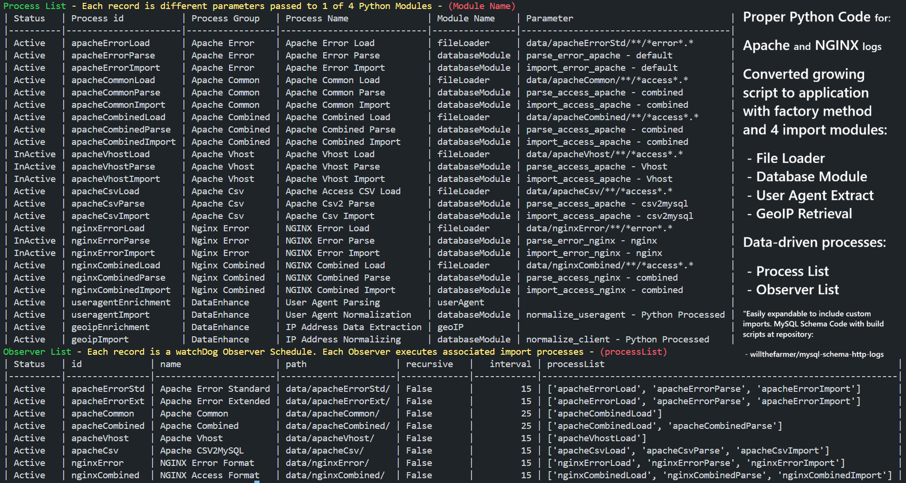

# Database designed for HTTP log data analysis

## This repository contains all individual DDL and build scripts
Every script and build file used in database application development is here. Individual Function and Procedure files make applying modifications much simplier. The Python build script assembles hundreds of SQL filess together into the single `build_http_logs_schema.sql` file that creates the entire MySQL schema and is included in the Python application repository [httpLogs2MySQL](https://github.com/willthefarmer/http-logs-to-mysql).

## Database runs on MySQL & MariaDB
This is a fast, reliable processing application with detailed logging and two stages of data parsing.

First stage is performed in `LOAD DATA LOCAL INFILE` statements with "log format" data-driven selection of LOAD settings and load_ staging tables.

Second stage is performed in parsing modules: `parse_access_apache, parse_access_nginx, parse_error_apache, parse_error_nginxprocess_access_parse` 

HTTP Access and Error data nrmalization and import is done in MySQL modules: `import_access_apache, import_access_nginx, import_error_apache, import_error_nginx`

Client IP GeoData is retrieved with Python. Data normalization & import is done in MySQL module: `normalize_client`

User Agent String is parsed with Python. Data normalization & import is done in MySQL module: `normalize_useragent`

Access and Error data is imported and normalized in modules: `import_access_apache, import_access_nginx, import_error_apache, import_error_nginx` Stored Procedures.

Python handles polling of log file folders and executing Database LOAD DATA, Stored Procedures, Stored Functions and SQL Statements. Python drives the application but MySQL or MariaDB does all Data Manipulation & Processing.

Application determines what files have been processed using `import_file` TABLE.

Each imported file has record with name, path, size, created, modified attributes inserted during `process_logs`.

## Application runs on Windows, Linux & MacOS

## Python handles File Processing & Database handles Data Processing
The Python application repository is [httpLogs2MySQL](https://github.com/willthefarmer/http-logs-to-mysql) which is a data-driven Python Application to automate importing Access & Error files, normalizing log data into database and generating a well-documented data lineage audit trail.

Multiple Access and Error logs and formats can be loaded, parsed and imported along with User Agent parsing and IP Address Geolocation retrieval processes within a single "Import Load" execution. 

## Visual Interface App
[MySQL2ApacheECharts](https://github.com/willthefarmer/mysql-to-apache-echarts) is a ***visualization tool*** for the Database Schema currently under development. The Web interface consists of [Express](https://github.com/expressjs/express) web application frameworks with [W2UI](https://github.com/vitmalina/w2ui) drill-down data grids for Data Point Details 
& [Apache ECharts](https://github.com/apache/echarts) frameworks for Data Visualization.
